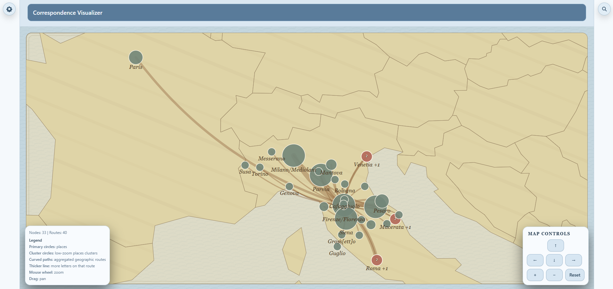
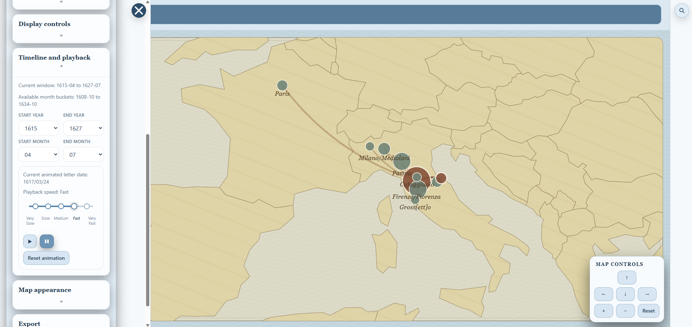
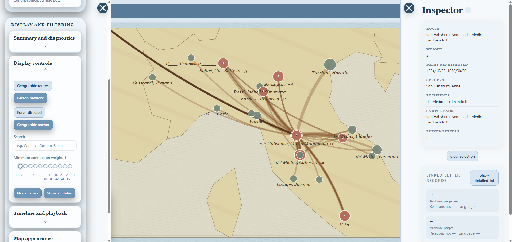
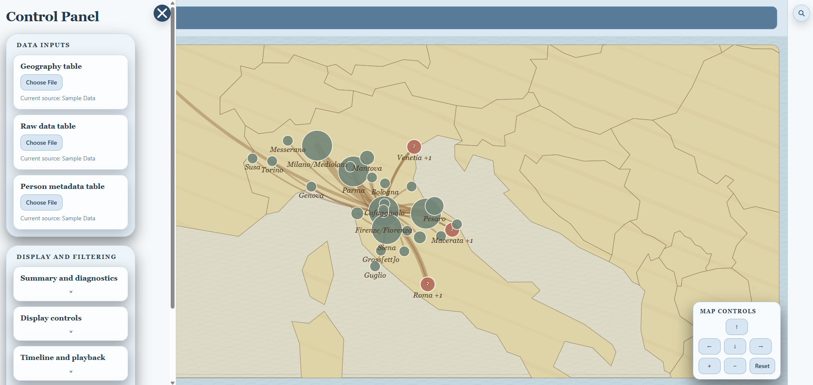
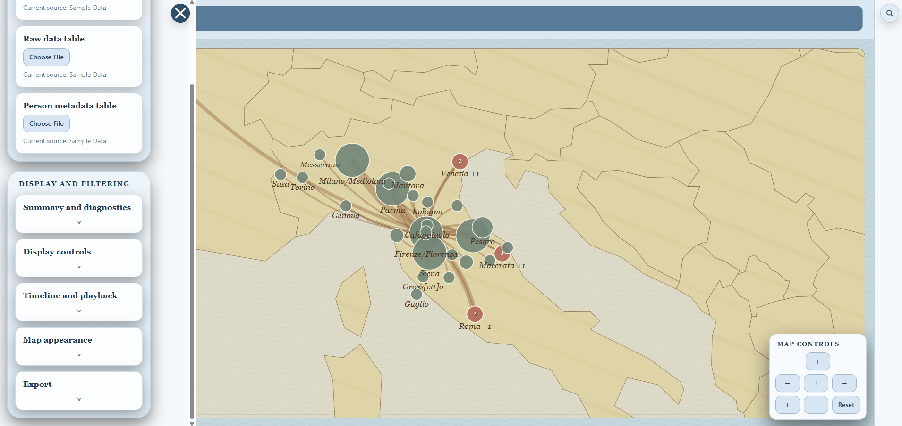
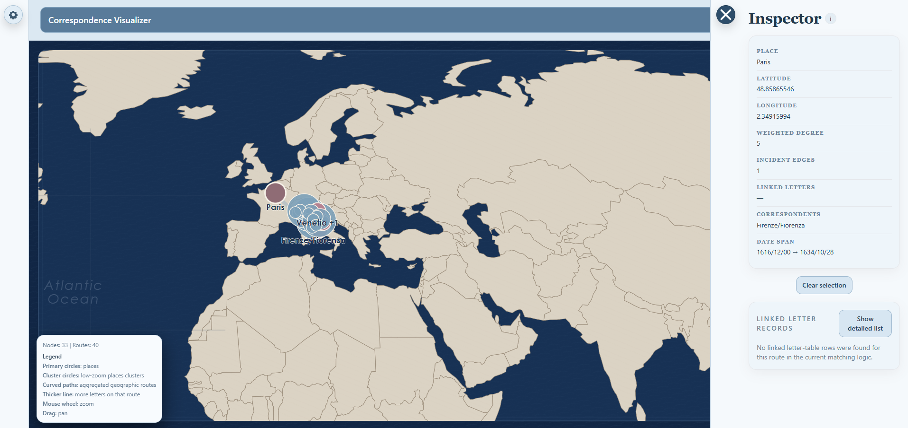

# Correspondence Visualizer

## 1. Project Title

**Correspondence Visualizer** is a research-oriented interactive web app for exploring historical correspondence networks as either **geographic routes** or **person-to-person relationship graphs**. It is designed for projects where letters, correspondents, places, and dates need to be explored together in a visual environment rather than only in spreadsheets or static maps.

---

## 2. One-Paragraph Summary

This application ingests correspondence-related tabular data, derives network structures from that data, and renders an interactive visualization workspace with filtering, inspection, timeline controls, playback, theme customization, and export tools. The current codebase supports both a **geographic view** and a **person view**, along with node/edge/cluster inspection and export to **SVG**, **PNG**, **nodes CSV**, and **edges/routes CSV**.

---

## 3. Current Status

This repository represents an **active prototype / research tool in ongoing development**.

The current state of the project includes:

- working geographic and person-network visualization modes
- timeline filtering and playback infrastructure
- inspector and control-panel workflows
- theme preset support and map-stage overlays
- export tooling for both images and tabular data
- several successful bounded refactors that extracted helper modules from `src/App.jsx`
- a true pre-settled **force-directed person-network layout** backed by `d3-force`
- a **geographic-anchor person layout** that still places correspondents by mappable location
- a force-directed person view that now renders on a **clean theme-driven background** rather than over the geographic map
- inspector-internal navigation between people and places
- a working inspector **Back** button for internal navigation

The codebase is functional, but it is still under active maintenance. The largest remaining structural issue is that significant orchestration logic still lives in `src/App.jsx`.

---

## 4. Key Features

### Visualization modes

- **Geographic view** for mapping correspondence routes between places
- **Person view** for exploring correspondence as a network of people rather than locations
  - **Force-directed** person layout using a pre-settled `d3-force` simulation
  - **Geographic anchor** person layout using each person’s most-used mappable location

### Data interaction

- CSV-based data ingestion
- fallback embedded sample geography data so the app can render before user uploads
- derived node, edge, cluster, and timeline structures based on uploaded or embedded data

### Research workflow tools

- hover and click inspection
- right-side inspector for selected nodes, edges, clusters, and linked records
- inspector-internal navigation between people and places
- connected-correspondent navigation ordered by relationship weight
- person-detail place sections for:
  - **Places this person sent letters to**
  - **Places where this person received letters**
- inspector **Back** button for returning to the previous internal inspector panel
- timeline range filtering
- playback controls for chronological exploration
- map legend, title bar, and floating control overlays

### Visual customization

- theme token system with presets
- map and interface chroming controlled primarily through theme values rather than a large global stylesheet
- mode-sensitive stage rendering so the **force-directed person view** uses a clean themed background while geographic modes retain the map backdrop

### Export tools

- export current visualization state as **SVG**
- render SVG export to **PNG**
- export derived **nodes CSV**
- export derived **edges/routes CSV**

---

## 5. Screenshots

The following screenshots reflect the current live app state.

### Geographic view overview



### Person view overview


### Timeline and playback controls



### Inspector detail view



### Geographic inspector example


### Control panel overview



### Additional control panel state



### Modern theme examples




---

## 6. Tech Stack

This project currently uses:

- **React 18** for UI composition and stateful interaction
- **Vite** for development/build tooling
- **Tailwind CSS** for utility-driven styling
- **d3-geo** for projection and map geometry work
- **d3-force** for pre-settled force-directed person-network layout
- **topojson-client** for geographic feature handling
- **world-atlas** for world basemap data

The map-stage rendering logic is SVG-based, with exported SVG optionally rasterized to PNG during export workflows.

---

## 7. Project Structure

The current `src/` structure is:

```text
src/
  App.jsx
  exportHelpers.js
  index.css
  InspectorBackButton.jsx
  InspectorConnectedCorrespondents.jsx
  InspectorPersonPlaces.jsx
  interactionHelpers.js
  main.jsx
  mapInteractionHandlers.js
  mapLayoutHelpers.js
  mapStageComponents.jsx
  personForceLayoutHelpers.js
  timelinePlaybackComponents.jsx
  timelinePlaybackHelpers.js
```

### Module overview

#### `src/main.jsx`
Bootstraps the React application and mounts `<App />`.

#### `src/index.css`
Contains a minimal global layer for Tailwind directives, full-height layout rules, and base font settings.

#### `src/App.jsx`
The main orchestration layer. It currently handles top-level application state, data ingestion and normalization, graph derivation, theme token logic, inspector state, and workspace composition.

#### `src/mapLayoutHelpers.js`
Pure helper logic for viewport construction, clustering, label visibility, and geometric calculations.

#### `src/interactionHelpers.js`
Selection and inspection logic, including:
- nearby candidate generation
- selection resolution
- person-detail and place-detail payload derivation
- weighted connected-correspondent ordering
- person-detail place-section derivation

#### `src/mapInteractionHandlers.js`
Centralized map interaction handler factory for hover/click/selection behavior.

#### `src/timelinePlaybackHelpers.js`
Pure timeline/playback derivation helpers.

#### `src/timelinePlaybackComponents.jsx`
Timeline/playback UI boundary.

#### `src/mapStageComponents.jsx`
Map-stage-adjacent UI/chrome components.

#### `src/exportHelpers.js`
Export subsystem utilities for CSV, SVG, and PNG output.

#### `src/personForceLayoutHelpers.js`
Pure helper logic for the pre-settled force-directed person-network layout.

#### `src/InspectorConnectedCorrespondents.jsx`
Inspector navigation component for person-to-person navigation, showing correspondents ordered by relationship weight and labeled by letter count.

#### `src/InspectorPersonPlaces.jsx`
Inspector navigation component for person-to-place navigation, showing:
- **Places this person sent letters to**
- **Places where this person received letters**

#### `src/InspectorBackButton.jsx`
Inspector-internal Back button component for returning to the previous person/place panel.

---

## 8. Installation and Development

### Prerequisites

You should have a recent version of:

- **Node.js**
- **npm**

### Install dependencies

```bash
npm install
```

### Start the development server

```bash
npm run dev
```

### Build for production

```bash
npm run build
```

### Preview the production build

```bash
npm run preview
```

### Repository location

GitHub repository:

```text
https://github.com/haleyrp1803/correspondence-visualizer
```

---

## 9. Data Inputs

This is a data-driven visualization app.

The app is intended to work with correspondence-related tabular data that includes some combination of:

- dates
- source person
- target person
- source location
- target or inferred target location
- source latitude / longitude
- target latitude / longitude
- linked letter metadata
- person metadata

The source code currently includes embedded fallback geography-style sample data so that the app can render before user uploads are provided.

---

## 10. How to Use the App

A typical workflow is:

1. Open the app.
2. Load or work from available data.
3. Choose geographic view or person view.
4. Adjust filters.
5. Use the timeline if needed.
6. Hover or click nodes, edges, or clusters to inspect them.
7. Use the inspector to navigate between people and places.
8. Use the inspector **Back** button to return to the previous internal panel.
9. Export the current state as SVG, PNG, or CSV outputs.

---

## 11. Known Limitations and Fragile Zones

### Current structural limitation

- `src/App.jsx` still contains a large amount of orchestration logic and remains the main concentration point in the codebase.

### Known fragile zones

The maintainer documentation identifies the following areas as especially sensitive:

- viewport centering/reset behavior
- dense-map hover/click interaction
- selection persistence across filters
- playback/timeline state coupling
- export rendering/state coupling
- broad orchestration work inside `src/App.jsx`
- inspector-open interactions

### Practical implication

If you are making changes, avoid broad mixed-purpose edits. Prefer bounded passes that touch one subsystem at a time.

---

## 12. Maintainer Documents

This repository includes internal maintenance and workflow documents that should be consulted before major edits:

- **`MAINTAINERS_GUIDE.md`**
- **`PROJECT_WORKFLOW_CHARTER.md`**
- **`CHANGELOG.md`**
- **`CONTROL_PANEL_DEPENDENCY_MAP.md`**
- **`VIEWPORT_TIMELINE_AUDIT.md`**

---

## 13. Roadmap / Near-Term Priorities

Likely near-term priorities include:

- continued safe reduction of orchestration pressure inside `src/App.jsx`
- improved data-input documentation
- incremental inspector-navigation refinement
- deferred UI polish such as anchoring the Back button directly under the inspector close control

---

## 14. License / Author / Acknowledgments

### Author / Maintainer

Repository owner: **Haley R. P.**

### License

Add the project’s chosen license here if and when one is finalized.
